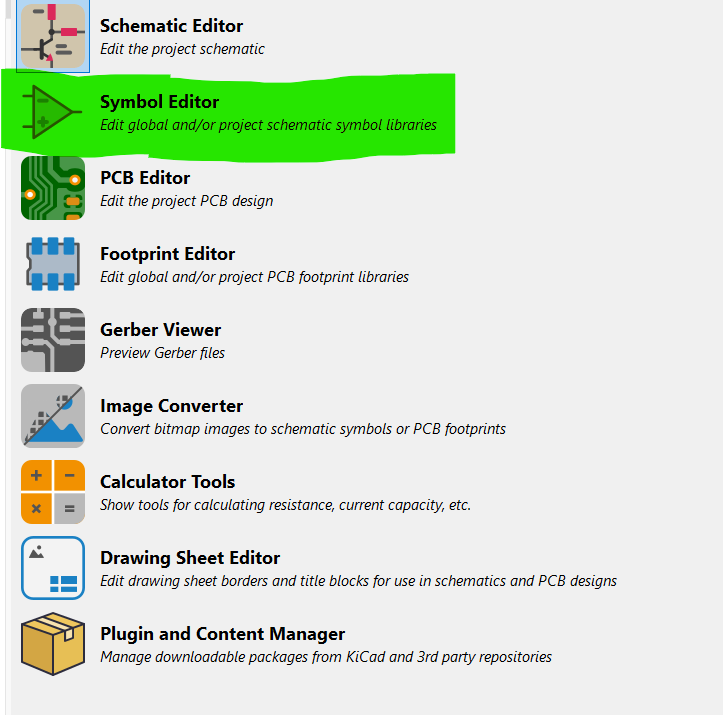

# KiCad PCB Design 
### Design of transmiiter for the flight controller using KiCAD 

## To desing a custon Symbol
1. Symbol is a representation of a component.
2. It dosen't reflect the dimensions of the component.
3. It should have every pin names.

### Steps to create a custom symbol in KiCAD
1. Open KiCAD.
2. Open Symbol editor.
<i >

</i>
