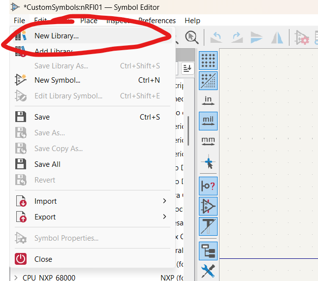
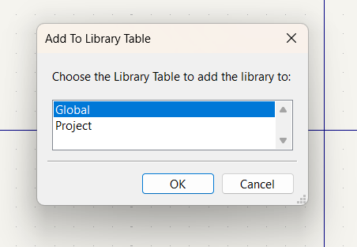
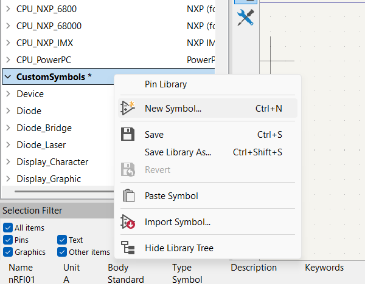
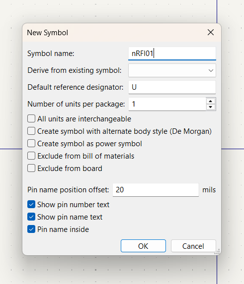
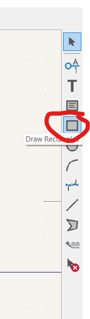
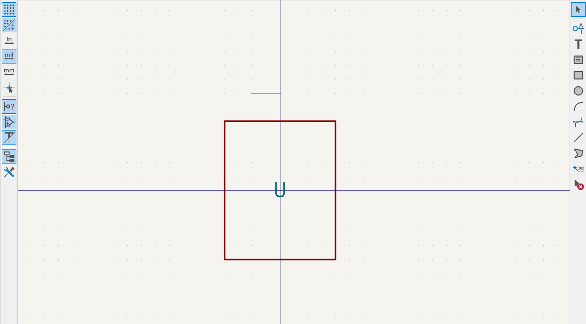

# 🧩 KiCad PCB Design  
### Design of Transmitter for the Flight Controller using KiCad

---

## 🛠️ To Design a Custom Symbol

1. A **symbol** is a representation of a component.  
2. It doesn’t reflect the physical **dimensions** of the component.  
3. It should have **all pin names** clearly labeled.

---

### ⚙️ Steps to Create a Custom Symbol in KiCad

1. Open **KiCad**.  
2. Open **Symbol Editor**.  

  

3. Choose **File → New Library**.  

  

4. Choose **Global** to use the symbol in every project,  
   or **Project** to use it only for the current project.  
   (Here, I chose *Global*.)

  

5. Save the new library in the **symbols directory** under your desired name.

6. Right-click on the library you made (**CustomLibrary**) and select **New Symbol**.  

  

7. Edit the **Symbol Name** and click **OK**.  
   If you want to develop your symbol from an existing one,  
   check **Derive from existing symbol** and select the location.  

  

8. Choose **Draw Rectangle** to create the symbol layout.  

  

9. Draw the symbol layout to include all pin names.  

  

